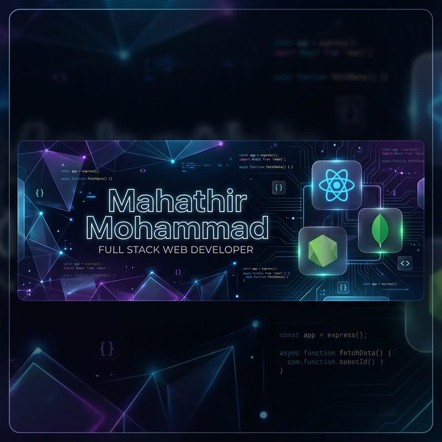

# 👋 Hi, I'm Mahathir Mohammad

  <h3>🚀 Full Stack Web Developer | MERN Stack Specialist</h3>
  
Building high-performance, scalable web applications with a focus on seamless user experiences and modern design.

  
  

    <a href="https://devmahathir.netlify.app">🌍 Portfolio</a> •
    <a href="https://linkedin.com/in/mahathir-mohammad-4073b33b2/">🔗 LinkedIn</a> •
    <a href="mailto:mahathirm880@gmail.com">📩 Email</a>
  

---

### 🧑‍💻 About Me

I am a results-driven **Full Stack Developer** based in **Kushtia, Bangladesh**. I specialize in the **MERN ecosystem**, crafting everything from sophisticated frontends with high-end animations to robust, scalable backend architectures.

- 🔭 I’m currently working on high-performance E-commerce solutions.
- 🌱 I’m currently deepening my expertise in **Next.js 14 App Router** and **Server Actions**.
- 🎨 Passionate about **Creative Development** with GSAP and Framer Motion.
- 💬 Ask me about **React, Node.js,** or why **Tailwind CSS** is a game-changer.
- 📫 How to reach me: **[mahathirm880@gmail.com](mailto:mahathirm880@gmail.com)**

---

### 🛠️ Tech Stack

<b>Frontend Development</b>

  
  
  
  
  
  

<b>Backend & Database</b>

  
  
  
  

<b>Tools & Deployment</b>

  
  
  
  
  

---

### 🚀 Featured Projects

#### 🛍️ [Aura Store – Premium E-commerce Platform](https://github.com/grontho69)
*Full-stack Clothing Brand platform built with Next.js 14.*
- **Features:** Dynamic Cart System, Admin Dashboard, Stripe Integration, NextAuth Authentication.
- **Tech:** Next.js (App Router), MongoDB, Tailwind CSS, GSAP.

#### 🎨 [ZenITH – Creative Developer Portfolio](https://devmahathir.netlify.app)
*Ultra-modern interactive portfolio with cinematic animations.*
- **Features:** Anti-gravity theme, Glassmorphism UI, Responsive Design, Smooth Scroll.
- **Tech:** React, Framer Motion, GSAP, Tailwind CSS.

---

### 📊 GitHub Statistics

  
  

  

---

### 🤝 Connect with me

  
  
  
  

  

