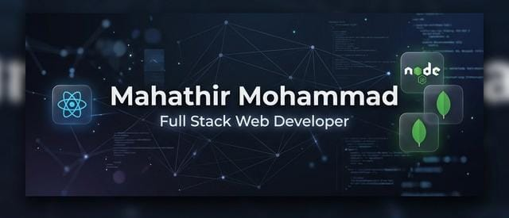

  

  <h1>👋 Hey there, I'm <a href="https://devmahathir.netlify.app">Mahathir Mohammad</a></h1>
  
  

    
  

  

    Crafting high-performance, responsive web applications with cutting-edge technologies, fluid animations, and robust backend architectures.
  

  

    
    
    
    
  

---

### 🧑‍💻 About Me

I am a passionate **Full Stack Developer** based in **Kushtia, Bangladesh**. I specialize in creating pixel-perfect, scalable web experiences using the **MERN** stack and **Next.js**.

- 🔭 **Currently building:** High-performance Full-Stack E-Commerce platforms & modern SaaS applications.
- ⚡ **Leveling up on:** **TypeScript**, **SQL (PostgreSQL / MySQL)**, and advanced **Next.js 14/15 App Router & Server Actions**.
- 🎨 **Creative Design:** Exploring advanced animations with **GSAP**, **Framer Motion**, and modern UI/UX design paradigms.
- 💡 **Open to:** Exciting freelance opportunities, full-stack collaborations, and innovative open-source contributions.
- 💬 **Ask me about:** React, Next.js, Node.js, Express, MongoDB, Tailwind CSS, or clean architecture.
- 📫 **Direct contact:** [mahathirm880@gmail.com](mailto:mahathirm880@gmail.com)

---

### 🛠️ Tech Stack & Skills

<table>
  <tr>
    <td width="20%"><b>Languages</b></td>
    <td>
      
      
      
      
      
    </td>
  </tr>
  <tr>
    <td><b>Frontend</b></td>
    <td>
      
      
      
      
      
    </td>
  </tr>
  <tr>
    <td><b>Backend & Database</b></td>
    <td>
      
      
      
      
      
    </td>
  </tr>
  <tr>
    <td><b>Tools & Services</b></td>
    <td>
      
      
      
      
      
      
    </td>
  </tr>
</table>

---

### 🚀 Featured Projects

<table>
  <tr>
    <td width="50%" valign="top">
      <h3 align="left">🛍️ <a href="https://e-commerce-eta-kohl-38.vercel.app/">Volans – E-Commerce Platform</a></h3>
      
<i>Full-stack modern clothing & apparel platform built for seamless shopping experiences.</i>

      <ul>
        <li><b>Key Features:</b> Dynamic Cart & Checkout, Admin Management, Stripe Payment Gateway, Secure Auth.</li>
        <li><b>Tech:</b> Next.js 14 (App Router), MongoDB, Tailwind CSS, GSAP</li>
      </ul>
      

        <a href="https://e-commerce-eta-kohl-38.vercel.app/">🔗 <b>Live Demo</b></a>
      

    </td>
    <td width="50%" valign="top">
      <h3 align="left">🎨 <a href="https://devmahathir.netlify.app">ZenITH – Interactive Portfolio</a></h3>
      
<i>Ultra-modern developer portfolio featuring interactive cinematic micro-interactions.</i>

      <ul>
        <li><b>Key Features:</b> Glassmorphic UI, responsive layouts, smooth scroll, dynamic theme animations.</li>
        <li><b>Tech:</b> React, Framer Motion, GSAP, Tailwind CSS</li>
      </ul>
      

        <a href="https://devmahathir.netlify.app">🔗 <b>Live Demo</b></a>
      

    </td>
  </tr>
  <tr>
    <td width="50%" valign="top">
      <h3 align="left">✨ <a href="#">Project Three (Coming Soon / Showcase)</a></h3>
      
<i>Full-stack application built with TypeScript, SQL, and modern API architecture.</i>

      <ul>
        <li><b>Key Features:</b> RESTful / GraphQL API, role-based access control, relational database design.</li>
        <li><b>Tech:</b> TypeScript, Next.js, PostgreSQL / SQL, Tailwind CSS</li>
      </ul>
      

        <a href="#">🔗 <b>Live Demo</b></a> • <a href="#">💻 <b>GitHub Repo</b></a>
      

    </td>
    <td width="50%" valign="top">
      <h3 align="left">⚡ <a href="#">Project Four (Coming Soon / Showcase)</a></h3>
      
<i>Scalable web application or real-time dashboard solution.</i>

      <ul>
        <li><b>Key Features:</b> Interactive data visualization, authentication, high-performance querying.</li>
        <li><b>Tech:</b> React / Next.js, Node.js, Express, MongoDB / SQL</li>
      </ul>
      

        <a href="#">🔗 <b>Live Demo</b></a> • <a href="#">💻 <b>GitHub Repo</b></a>
      

    </td>
  </tr>
</table>

---

### 📊 GitHub Activity & Stats

  
  

  

---

### 🤝 Let's Connect

  
  
  
  

  

